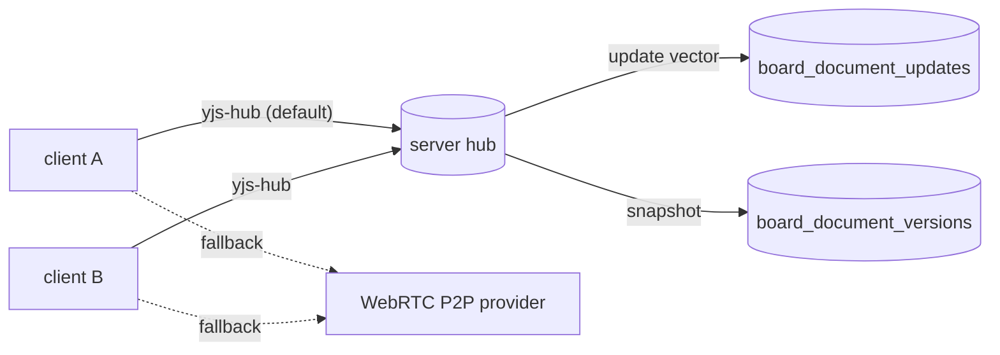

# Realtime Collab Phase 1 設計仕様

Issue #202 (figma / miro 級 realtime collab) の Phase 1 (T001 yjs 採用判定 / T002 schema 拡張案 / T003 y-websocket 配線設計) を SSOT 化する。 本 spec の対象は **設計確定** のみで、 実装は Phase 2 以降の別 PR とする。

## 0. 前提状態

PR #201 と直近 commit (`d28c2614`) で以下が完了済。

- design 本体は `board_documents` (Turso) を SSOT に統一済 (`exportFigFile` の binary を base64 で保持)
- IndexedDB cache は撤去済 (`src/app/document/io/pen-cache.ts` は no-op)
- pin / preview は `board_pins` / `board_previews` で server SSOT 化済
- `src/app/collab/` 配下に yjs ベースの実装は既に存在 (`session.ts` の `Y.Doc` / `awarenessProtocol` / `IndexeddbPersistence` / `yjs-sync.ts`)、 transport は WebRTC P2P (`webrtc-provider.ts` + `room.ts`) + 自前 WebSocket signaling (`packages/api/src/ws/signaling.ts`)

Phase 1 の役割は「既に存在する yjs runtime に server-mediated transport を追加し、 P2P 失敗時の fallback と server 側持続化を両立させる土台を作る」こと。 yjs を新規導入するわけではない。

## 1. T001 ... yjs 採用判定

### 1.1 結論

**yjs を継続採用する** (automerge へは切り替えない)。

### 1.2 判定根拠

| 観点 | yjs | automerge | 判定 |
|---|---|---|---|
| 既存配線 | `Y.Doc` / `Y.Map` / awareness が `src/app/collab/` で既稼働 | 未導入、 全 graph binding を書き直し | yjs |
| graph 形状 | `Y.Map<string, Y.Map<unknown>>` で SceneNode に近い (`yjs-sync.ts`) | JSON-CRDT で同等性能だが node id key の dict 設計を作り直し | yjs |
| transport | `y-websocket` (server 1 file 等価)、 `y-webrtc` (P2P) が公式提供 | `automerge-repo` で websocket adapter 提供だが server 側 npm 依存が重い | yjs |
| awareness (cursor / 選択) | `y-protocols/awareness` が既に組み込まれ完成 | 別実装 `@automerge/automerge-repo` で並列実装、 既存 cursor 移行コスト | yjs |
| 永続化 | `y-leveldb` / `y-indexeddb` / 自作 persistence adapter で update vector を append-only 保持できる | binary doc snapshot + delta、 SQLite に直接書ける形 | yjs |
| 学習曲線 | チーム内に既知 (`yjs-sync.ts` を書いた経緯がある) | 新規導入で学習コスト | yjs |
| 実績 | tldraw / Linear / Affine / Logseq 採用 | Atlassian / Ink & Switch が中心 | yjs |
| WebRTC fallback | `y-webrtc` を既に使っているのでそのまま fallback に残せる | `automerge-repo-network-webrtc` も存在するが互換性別物 | yjs |

automerge へ切り替えるメリットは「graph 形状を JSON 1 本にまとめやすい」ことだが、 既存 `yjs-sync.ts` の `Y.Map<Y.Map>` 表現も同等の SceneNode 表現を達成しており切替コストに見合わない。

### 1.3 依存 package

実装 phase で `package.json` (root と `packages/api`) に追加するもの。

| package | 用途 | 推定 version |
|---|---|---|
| `yjs` | core (既存) | 既存 ^13 系を維持 |
| `y-protocols` | sync / awareness protocol (既存) | 既存版 |
| `y-websocket` | client 側 websocket provider | 公式安定版 |
| `lib0` | y-websocket / y-protocols 共通 utility (既に推移依存) | peer dep 自動 |

server 側は **`y-websocket` の utility ではなく自作 hub** とする (2 章で論証)。 公式 `y-websocket/bin/server.js` は Node-only かつ `WebSocket` 部分が `ws` package 依存で、 Bun.serve の WS と整合させづらいため。

## 2. T002 ... schema 拡張案

### 2.1 方針

`board_documents` は「最新 snapshot を保持する 1 行 / board」の役割を維持しつつ、 並列に「append-only な update vector log」と「定期 snapshot 履歴」を別表で持つ。

設計選択肢の比較。

| 案 | 構造 | 利点 | 欠点 | 判定 |
|---|---|---|---|---|
| A | `board_documents.bytes` に yjs update を直接 base64 で上書き | 1 表で完結 | append-only でないため履歴消失、 conflict 解決経路なし | 不可 |
| B | `board_documents` (snapshot) + `board_document_updates` (append-only update vector) + `board_document_versions` (snapshot 履歴) | 履歴 / 巻き戻し / 監査が成立 | 表 3 つ + compaction routine | **採用** |
| C | yjs update を `board_documents.bytes` に append concat | 表追加なし | bytes 列が無限肥大、 GET で全 read 必要 | 不可 |

### 2.2 schema 拡張 (Drizzle)

`packages/api/src/db/schema.ts` に以下を追加する想定 (Phase 2 で migration `0012_*.sql` 生成)。

```ts
export const boardDocumentUpdates = sqliteTable(
  'board_document_updates',
  {
    id: text('id').primaryKey(),
    boardId: text('board_id')
      .notNull()
      .references(() => boards.id, { onDelete: 'cascade' }),
    // yjs update bytes (base64 encoded)
    update: text('update').notNull(),
    size: integer('size', { mode: 'number' }).notNull(),
    createdAt: integer('created_at', { mode: 'number' }).notNull(),
    createdByUserId: text('created_by_user_id').references(() => users.id, {
      onDelete: 'set null'
    })
  },
  (table) => [
    index('board_document_updates_board_id_idx').on(table.boardId),
    index('board_document_updates_created_at_idx').on(table.createdAt)
  ]
)

export const boardDocumentVersions = sqliteTable(
  'board_document_versions',
  {
    id: text('id').primaryKey(),
    boardId: text('board_id')
      .notNull()
      .references(() => boards.id, { onDelete: 'cascade' }),
    // 直近 snapshot の Y.Doc state vector を base64 で保持。
    // 復元は state + 以降の update を applyUpdate して得る。
    state: text('state').notNull(),
    size: integer('size', { mode: 'number' }).notNull(),
    createdAt: integer('created_at', { mode: 'number' }).notNull(),
    label: text('label')
  },
  (table) => [
    index('board_document_versions_board_id_idx').on(table.boardId),
    index('board_document_versions_created_at_idx').on(table.createdAt)
  ]
)
```

`board_documents` 自体は当面そのままにし、 「現在の snapshot を一発で GET したい / .fig export したい」用途で残す。 update sequence は `board_document_updates` を `created_at` 順で applyUpdate して構築する。

### 2.3 compaction routine

- N 件 (e.g. 1000 update) または N 時間 (e.g. 1 時間) ごとに hub が snapshot を `board_document_versions` に書き、 古い update を削除 (snapshot より前の update は applyUpdate 済として捨てられる)
- snapshot は最大 M 世代 (e.g. 100) で打ち切り、 古いものは削除 (履歴 UI の保持上限)
- `board_documents` (最新 snapshot 1 行 / board) は compaction 完了時に同期で書き換え (旧 client が .fig export として直接読める形を維持)

### 2.4 安全境界

- yjs update は最大 サイズ 上限 (e.g. 64 KB / 1 件) を hub 側で enforce、 巨大 update は拒否
- update 数は board あたり / sec 上限 (e.g. 200 ops / 5 sec) で rate limit
- 削除は board 削除時 cascade (`onDelete: 'cascade'`)

## 3. T003 ... y-websocket hub 配線設計

### 3.1 endpoint と protocol

| 項目 | 値 |
|---|---|
| path | `/api/ws/yjs/:boardId` |
| sub-protocol | `yjs-v1` (将来 v2 への upgrade hook) |
| frame format | y-protocols `sync` (messageSync) + `awareness` (messageAwareness) で binary frame |
| auth | session cookie + `canAccessBoard` 判定 (`packages/api/src/auth/actor.ts`)、 拒否時は WS close code `4401` |
| ping/pong | 30 秒 idle で server から ping、 60 秒 silence で close |
| 最大同時接続 | board あたり 50 client (運用上限、 hub map で enforce) |

### 3.2 ファイル配置

```
packages/api/src/ws/
  signaling.ts        # 既存 WebRTC signaling (温存)
  notifications.ts    # 既存 notifications WS (温存)
  yjs-hub.ts          # 新規 ... board ごとの Y.Doc 保持 hub
  yjs-message.ts      # 新規 ... y-protocols message encode/decode 薄ラッパ
```

### 3.3 hub 内部状態

`yjs-hub.ts` の概念モデル。

```ts
type BoardRoom = {
  boardId: string
  ydoc: Y.Doc                // server side authoritative
  awareness: Awareness       // presence broadcast
  clients: Set<ServerWebSocket>
  pendingUpdates: Y.YEvent<unknown>[]
  lastSnapshotAt: number     // compaction trigger
  pendingPersistFlush: NodeJS.Timeout | null
}

type YjsHub = {
  handleRequest(req, server): Response | null
  handleOpen(socket): Promise<void>
  handleMessage(socket, message: Uint8Array): Promise<void>
  handleClose(socket): Promise<void>
}
```

### 3.4 開始経路 (load)

1. client connect (WSS path で auth cookie 送出)
2. server `canAccessBoard` 判定、 拒否なら close 4401
3. server room 取得 or 作成
4. 新規 room の場合 ... DB から `board_documents` + `board_document_updates` を read、 `Y.Doc.applyUpdate` で復元
5. server → client にて `syncStep1` を送る (initial sync handshake)
6. 既存 client がいれば awareness state を新 client に送信
7. 新 client の subscribe を完了、 以後 broadcast 経路へ

### 3.5 同期経路 (update)

1. client が graph 編集 → `Y.Doc` の `update` event 発火
2. client side ... bytes を encode して `messageSync` frame として server に send
3. server `yjs-hub` ... applyUpdate を server ydoc に反映、 awareness 例外、 update を全 client (送信元除く) に broadcast
4. server ... pending queue に積み、 `requestIdleCallback` 相当 (500 ms throttle) で `board_document_updates` insert + last snapshot から N 時間または N update 経過していれば `board_document_versions` snapshot + `board_documents` 更新を 1 transaction で flush

### 3.6 awareness 経路 (cursor / 選択)

- y-protocols `awareness` message を server で受信 → 同 board の他 client に broadcast (server は persist しない、 揮発状態)
- 既存 `local-awareness.ts` + `webrtc-provider.ts` の awareness とは「直列に統合」せず、 hub 経由を default に切替、 WebRTC awareness は graceful degradation

### 3.7 切断 / 再接続

- client 切断 → server room から remove、 0 client なら room を 5 分間保持 (再接続のため) → 5 分 idle で room 解放、 最終 snapshot flush
- client 側は `y-websocket` provider が自動再接続 (backoff 1 / 2 / 4 / 8 / 16 sec 最大 60)
- 再接続後は server から `syncStep1` で sync state vector を交換、 不足 update のみ送受

### 3.8 transport 切替 / 既存 P2P との関係



- default ... hub 経由 (server-mediated)
- fallback ... hub が unreachable な場合 1 秒以内に P2P provider を起動 (既存 `webrtc-provider.ts` を再利用)
- 切替判定 ... `yjs-hub` への WS open が 1 秒以内に成立しないか close 4401 等の auth エラー以外で close した場合、 P2P fallback を有効化

### 3.9 server 1 hub のスケール境界

- 単一 Bun process で hub を持つ前提 (初期実装)
- horizontal scale は今回スコープ外、 必要時に Redis pub/sub adapter or libsql vector sync で hub 同期
- 単一 process でも `Y.Doc` を board あたり 1 つに揃えれば数百 board / 数千 client は処理可能 (yjs は実績ベース)

### 3.10 認証 / 認可

- WS open 時に Cookie header から `better-auth` session を解決 (`packages/api/src/auth/index.ts` の `getAuthSession`)
- 未 sign-in は close `4401`
- session あり + `canAccessBoard` 拒否は close `4403`
- session ok + board access ok でのみ room join 許可

### 3.11 観測

- hub log ... `[yjs-hub] room=<boardId> action=<join|leave|update|snapshot> client=<n>`
- per-room counters ... `clients`, `updatesPerMin`, `awarenessPerMin` (`/api/internal/metrics` で expose、 admin のみ)
- DB I/O は `board_document_updates.created_at` の append rate を監視

## 4. 実装 Phase 2 への引き継ぎ事項

Phase 2 PR で着手するもの (本 spec の確定後)。

- T004 `packages/api/src/ws/yjs-hub.ts` 新設、 `BoardRoom` map と join / leave / broadcast
- T005 `yjs-message.ts` で `y-protocols` の syncStep1 / syncStep2 / updates / awareness の encode/decode 薄ラッパ
- T006 schema migration `0012_*.sql` 生成、 `board_document_updates` / `board_document_versions` 追加
- T007 `src/app/collab/yjs-websocket-provider.ts` 新設、 `y-websocket` 公式 provider を直接使うか自作 wrapper を作るか確定
- T008 既存 `webrtc-provider.ts` / `session.ts` の transport 取得を hub-first + P2P fallback に書き換え
- T009 hub 起動時の DB → `Y.Doc` 復元 / shutdown 時 flush の経路実装
- T010 unit / e2e tests (`tests/e2e/collab/realtime-sync.spec.ts` を hub 経由でも green になるよう更新)

## 5. 想定 risk と緩和

| risk | 影響 | 緩和 |
|---|---|---|
| hub プロセスが crash すると同期停止 | 全 client が不可、 編集ロスト可能 | 5 sec 以内に restart、 復元は DB → `Y.Doc` 経路、 P2P fallback で間繋ぎ |
| `board_document_updates` 肥大 | DB IO / latency 悪化 | compaction routine で snapshot + 旧 update 削除 (2.3) |
| 大量 awareness flood | 帯域消費 | rate limit + sample (例えば cursor は 30 fps cap、 awareness 50 ops/sec / client) |
| 認証 cookie 期限切れ | 編集中に WS が close | client side で 401 検出時に reload 提案 toast |
| 1 board あたり 100+ client | hub メモリ / fan-out 限界 | 50 client cap、 readonly fan-out モードを将来検討 |

## 6. 完了条件 (Phase 1 = 本 spec)

- [ ] T001 yjs 採用継続を本 spec で明文化 (上記 1 章)
- [ ] T002 schema 拡張案を Drizzle 形式で確定 (上記 2 章)
- [ ] T003 hub endpoint / protocol / 配置 / state / load / sync / awareness / 切断 / fallback / auth / 観測の 11 項目を確定 (上記 3 章)
- [ ] Issue #202 にコメントとして spec へのリンク追記、 親子関係明示

実装は Phase 2 以降、 別 PR / 別 commit で行う。 本 spec は SSOT として `docs/specs/realtime-collab-phase-1.md` を継続更新。

## 7. 関連

- 親 Issue ... #202 (本 spec の親)
- 直前 PR ... #201 (server SSOT 化 + IndexedDB 撤去)
- 既存 collab 実装 ... `src/app/collab/{session.ts,webrtc-provider.ts,yjs-sync.ts,room.ts,awareness.ts,local-awareness.ts,use.ts}`
- 既存 WS server ... `packages/api/src/ws/{signaling.ts,notifications.ts}` (本 spec ではこの隣に `yjs-hub.ts` を追加する想定)
- 公式 yjs ... https://docs.yjs.dev
- 公式 y-protocols ... https://github.com/yjs/y-protocols
- 公式 y-websocket ... https://github.com/yjs/y-websocket
